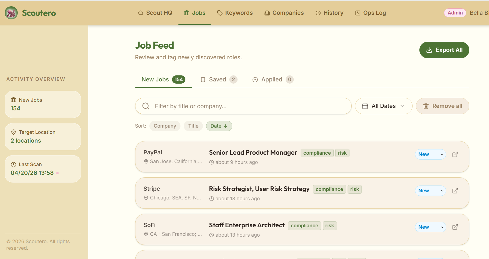
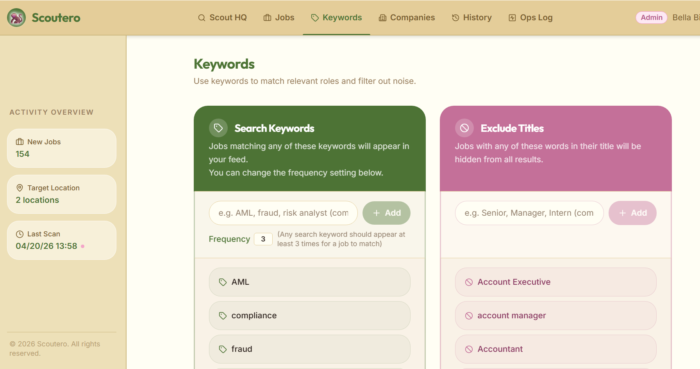
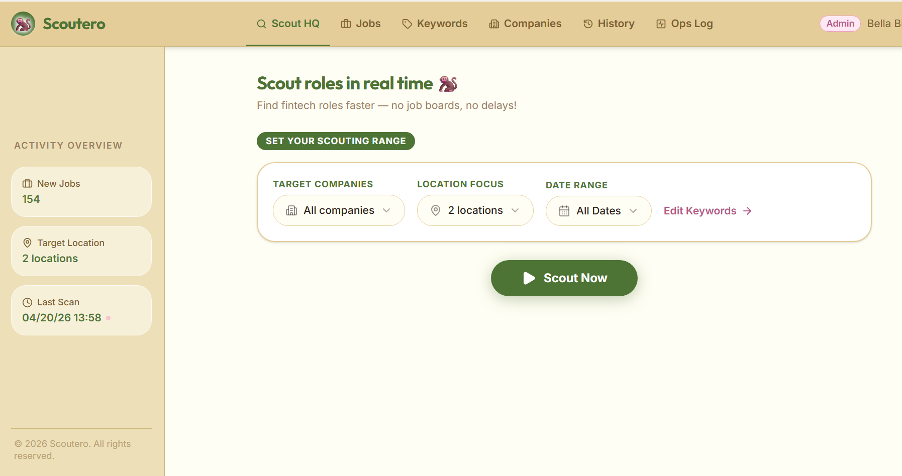
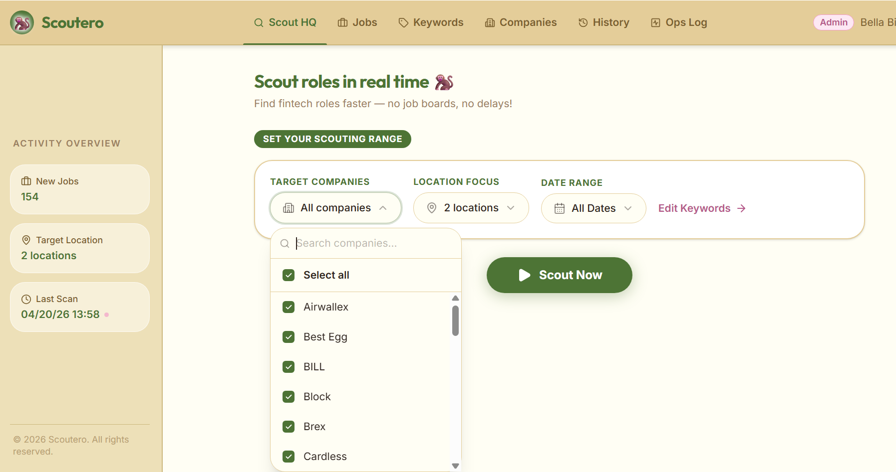

# Scoutero

Scoutero is a job scouting app that tracks fintech company career pages and surfaces relevant roles based on user-defined signals. Instead of relying on job boards, it allows users to monitor specific companies and run targeted searches when needed.

## How it works
- Tracks job postings from company career pages 
- Allows users to run scans on demand
- Filters results using keyword inclusion and exclusion
- Surfaces relevant roles with timestamps and tags for quick review

## Why I Built This
Scoutero was built out of frustration with job aggregators like LinkedIn, where algorithms often produce too much noise. My own job search focused on a niche area, financial crime and fraud, where a more targeted approach is needed. Scoutero gives users control over where they search, what signals they use, and how results are surfaced.

## Key Features

- **Company tracking** — maintain a list of target companies
- **On-demand scanning** — run searches when it makes sense for you
- **Keyword filtering** — define inclusion and exclusion signals
- **Adjustable match threshold** — control how strictly roles are matched
- **Role tracking** — mark roles as saved, applied, or irrelevant
- **Search history** — revisit previous scans

  
## Screenshots

### Jobs

### Keywords

### Main Page

### Company List

## Tech stack

- Frontend: React, Vite, TypeScript, Tailwind CSS
- Backend: Node.js, Express
- Database: PostgreSQL (Drizzle ORM)
- Auth: Clerk
- API client generation: Orval

## Notes

- Some backend logic (data ingestion, parsing, and scheduling) is not included in this repository.

## Future Improvements

- Expanded company coverage
- Automated scanning options

## Author

Bella Binus
